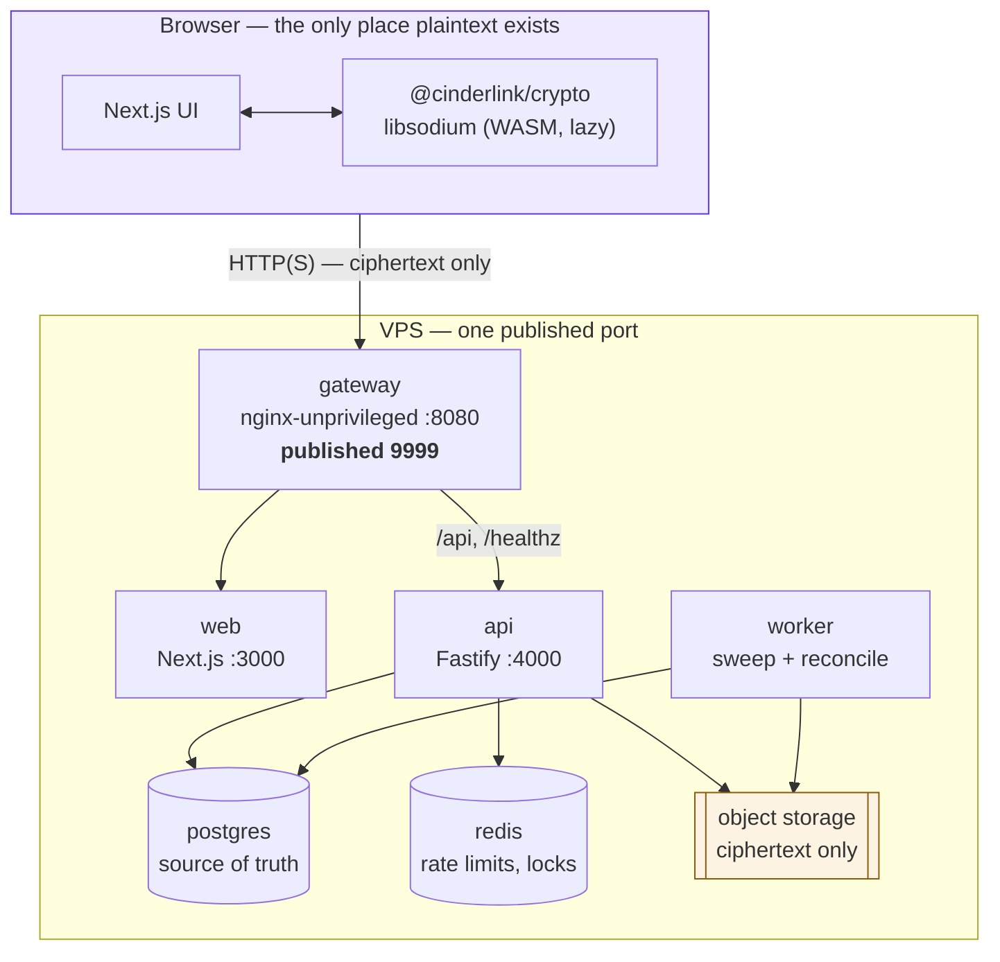
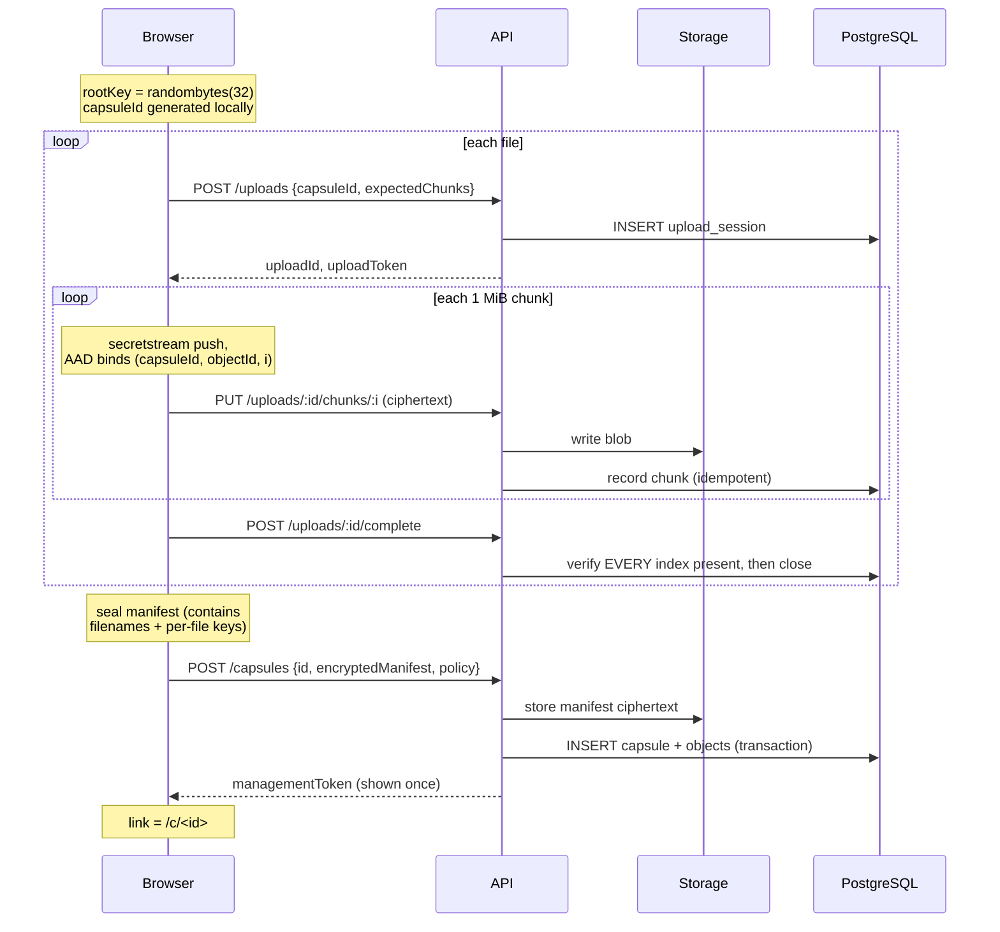
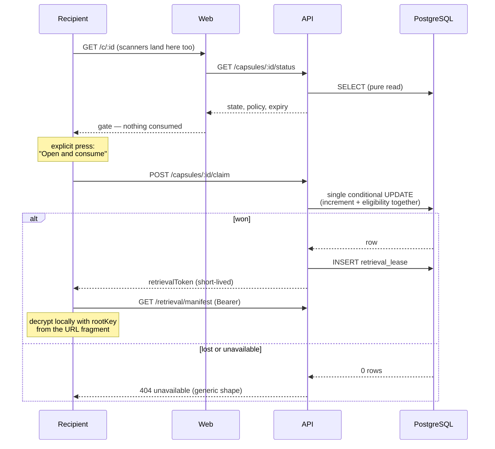

# Architecture

## Services



Only the gateway publishes a port. PostgreSQL, Redis, the API and the web app
are reachable only on `cinderlink_preview_9999_net`.

## Creating a capsule



The capsule row is created **only after every upload has completed**, so an
interrupted upload can never produce a usable capsule.

## Opening a capsule — the two-step gate



## Secure request

```mermaid
sequenceDiagram
    participant C as Creator
    participant A as API
    participant D as Responder

    Note over C: X25519 keypair;<br/>secret key stays in the fragment
    C->>A: POST /requests {publicKey, encryptedPrompt}
    A-->>C: managementToken
    D->>A: GET /requests/:id/status
    A-->>D: publicKey + encrypted prompt
    Note over D: contentKey = random(32)<br/>seal manifest under contentKey<br/>crypto_box_seal(contentKey, publicKey)
    D->>A: POST /requests/:id/submissions
    Note over D: ephemeral secret discarded —<br/>responder cannot reopen it
    C->>A: POST /manage/requests/:id/.../claim
    A-->>C: sealedKey + sealed manifest
    Note over C: crypto_box_seal_open with the<br/>secret key from the fragment
```

## Packages

| Package | Responsibility | Does I/O? |
|---|---|---|
| `@cinderlink/config` | Brand name (single source), limits, env guard | no |
| `@cinderlink/crypto` | capsule-envelope-v1: seal, open, wrap, stream | no |
| `@cinderlink/contracts` | Zod schemas for every request | no |
| `@cinderlink/database` | Schema, migrations, **the atomic claim** | PostgreSQL |
| `@cinderlink/storage` | `StorageAdapter` + filesystem implementation | filesystem |
| `@cinderlink/test-utils` | Fast bulk RNG, polling helpers | no |

`@cinderlink/crypto` performs no I/O by design: it takes bytes and returns
bytes, which keeps the security-relevant surface small and testable in
isolation.

## Key dependencies

| Dependency | Version | Why |
|---|---|---|
| libsodium-wrappers-sumo | 0.7.15 | Sumo build required for Argon2id |
| fastify | 5.2.0 | Small, fast, schema-first |
| pg | 8.13.1 | Direct SQL; the claim must be one statement |
| ioredis | 5.4.2 | Rate limiting only |
| next / react | 15.1.3 / 19.0.0 | App Router, standalone output |
| tailwindcss | 3.4.17 | Utility engine; all visual design is our own |
| zod | 3.24.1 | Contract validation |
| qrcode-generator | 1.4.4 | Zero-dependency; lazy-loaded on the result screen |

All versions pinned exactly. No CDN, no remote fonts, no third-party scripts.
